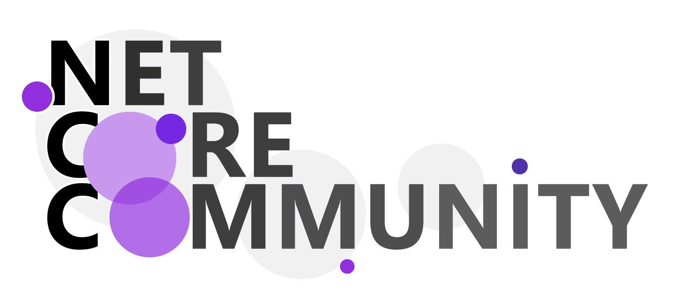
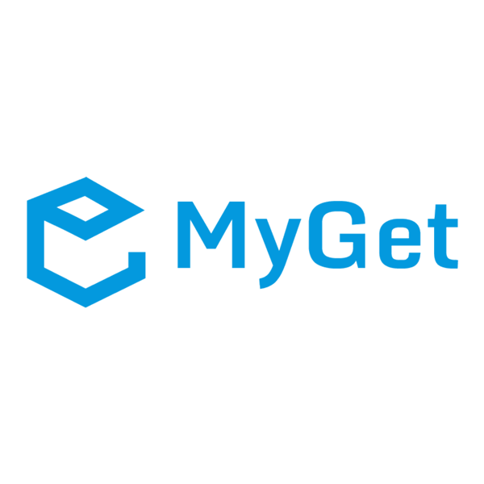
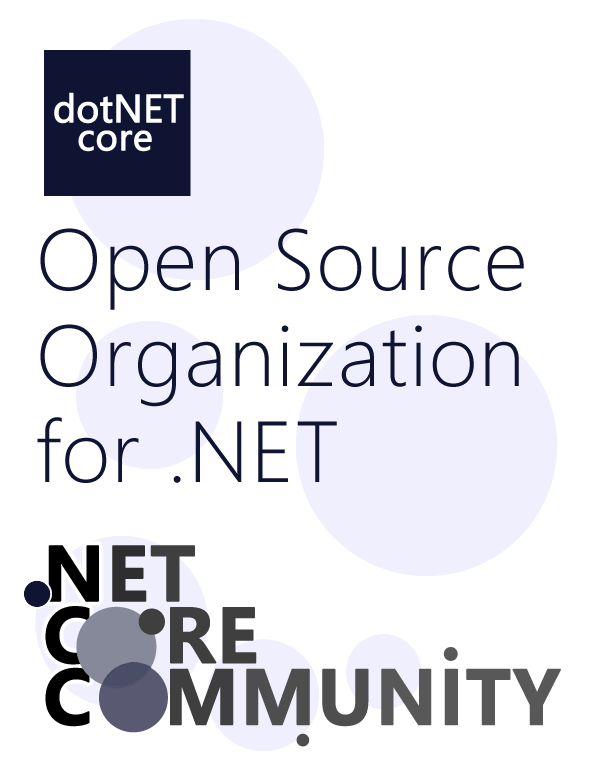

    &nbsp;
    

    English |  
    <a href="README.zh-CN.md">中文</a>

# .NET Core Community Home

.NET Core Community (means .net's central community, referred to as NCC) is an unofficial, non-profit open source community based on the .NET technology stack. It was organized by [LIU Haoyang](https://github.com/liuhaoyang), [HE Zhenxi](https://github.com/utilcore), [XIE Yang](https://github.com/kiler398), LOU Yu and [Alex LEWIS](https://github.com/alexinea) co-initiated the construction in mid-2016, with the participation of colleagues in the community. We hope that through our efforts, we can make the .NET ecosystem more exciting.

- Github: https://github.com/dotnetcore
- Website: https://www.dotnetcore.xyz
- CORE QQ Group: 436035237
- PURE QQ Group: by invitation
- WeChat Group: _Consult in the CORE QQ Group_

## The History of NCC

NCC was founded in mid-2016, the original name is ".NET Core China Studying Group". At the same time, we created a QQ Group called "dotNET Core Studying Group".

The original goal of NCC was to translate the documentation of Microsoft ASP.NET Core. We have received a lot of help and encouragement from many people ([List of contributors for 2016 translation project](./docs/history/people-who-translated-in-2016.md)). And [the works of our translation](https://github.com/dotnetcore/aspnetcore-doc-cn) also provided great convenient for the first Chinese developers who learned ASP.NET Core.

After two years of challenge, after several name adjustments, NCC became an open source community organization with more than one dozen projects and multiple sub-teams.

We have received support from many people, including the sponsorship of JetBrains.

At the beginning of 2019, we tried to cooperate with various local .NET technology communities in China and jointly launched the [.NET China Community Joint Meeting (NCJM)](https://github.com/dotnet-china), and provided the community with the NCC domain name asset 'dotnet-china.com'. We enabled the new domain name '[dotnetcore.xyz](https://www.dotnetcore.xyz)' instead.

At the end of 2019, we adopted and launched [MEMBER CODE OF CONDUCT](code-of-conduct.md). The four new rules and regulations revised and drafted by the community [Revision and Drafting Working Group (2019)](docs/history/revision-and-drafting-working-group-2019.md) passed the NCC PMC vote, and in Effective from January 1, 2020.

In 2020, a special year, we have updated the community rules and withstood multiple huge challenges. Member projects have made great progress. Surging has completed the incubation of NCC for a broader prospect and established an independent community. FlubuCore became the first .NET Foundation member project in our community. NCC Alipay SDK completed its historical mission and was archived.

In 2021, we look forward to the tremendous growth of our community.

## Members' Code of Conduct

In order to build an open, innovative, inclusive and welcoming community, we have published the [Code of Conduct for Members](code-of-conduct.md).

## Repos and Projects

Our project is divided into two phases: the _NCC Sandbox Projects phase_ and the _NCC Top-Level Projects phase_. When a new project is applied to join NCC and successfully pass the review and complete the preparatory work before joining, the project will automatically enter the _NCC Sandbox Projects phase_. If you want to apply to join NCC, please read the [How to join us](#how-to-join-us) section.

### Our Top-Level Projects

Projects in the _NCC Top-Level Projects phase_ can be used in production environments.

- **[AspectCore](https://github.com/dotnetcore/AspectCore-Framework)**, an AOP-based cross platform framework for .NET Standard.
- **[CAP](https://github.com/dotnetcore/CAP)**, a distributed transaction solution in microservice based on eventually consistency, also an eventbus with Outbox pattern.
- **[DotnetSpider](https://github.com/dotnetcore/DotnetSpider)**, a .NET Standard web crawling library similar to WebMagic and Scrapy. It is a lightweight ,efficient and fast high-level web crawling & scraping framework for .NET.
- **[FlubuCore](https://github.com/dotnetcore/FlubuCore)**, a cross platform build and deployment automation system for building projects and executing deployment scripts using C# code.([Example for FlubuCore](https://github.com/dotnetcore/FlubuCore.Examples))
  - [FlubuCore.CakePlugin](https://github.com/flubu-core/FlubuCore.CakePlugin) - a FlubuCore plugin that allows you to use any of the Cake addin in FlubuCore.
  - [FlubuCore.TeamsPlugin](https://github.com/flubu-core/FlubuCore.TeamsPlugin) - a FlubuCore plugin that adds Microsoft teams specific tasks.
- **[NPOI](https://github.com/dotnetcore/NPOI)** *([Archived with **announcement**](https://github.com/dotnetcore/NPOI/blob/master/README.md))*, a .net library for reading and writing MsOffice binary and OOXML file formats.

### Our Sandbox Projects

Projects in the _NCC Sandbox Projects phase_ are still in development and they need more time and practice to test their designs.

- **[AgileConfig](https://github.com/dotnetcore/AgileConfig)**, a lightweight configuration center based on .net core . It is easy to deploy , easy to learn , easy to use.
  - [AgileConfig Client](https://github.com/kklldog/AgileConfig_Client) - an AgileConfig client based on .NET Standard 2.0, can be run on nfx and core.
- **[Alipay SDK](https://github.com/dotnetcore/Alipay.AopSdk.Core)** *(Archived)*, a third-party Alipay server SDK, based on .NET Standard 2.0 development, provides a more reliable design than the official, but remains consistent with the official APIs.
- **[BootstrapBlazor](https://github.com/dotnetcore/BootstrapBlazor)**, a set of enterprise-class UI components based on Bootstrap and Blazor.
- **[CanalSharp](https://github.com/dotnetcore/CanalSharp)**, An open source .net client for [Alibaba Canal](https://github.com/alibaba/canal). Alibaba Cancal is an incremental publish & subscription component based on MySql's `binlog`. For more detail please visit [https://github.com/alibaba/canal/wiki](https://github.com/alibaba/canal/wiki).
- **[EasyCaching](https://github.com/dotnetcore/EasyCaching)**, an open source caching library that contains basic usage and some advanced usages of caching which can help us to handle caching more easier.
- **[FastGithub](https://github.com/dotnetcore/FastGithub)**，a GitHub accelerator. Used to solve the problems of GitHub unable to open, unable to load user avatar, unable to upload and download `releases`, `git-clone` `git-pull` `git-push` failure, etc.
- **[FreeSql](https://github.com/dotnetcore/FreeSql)**, is the ORM in .NET Core, .NET Framework and Xamarin. It supports [MySQL](https://www.mysql.com), [PostgreSQL](https://www.postgresql.org/), [SqlServer](https://www.microsoft.com/en-us/sql-server/), [Oracle](https://www.oracle.com/database/), [Sqlite](https://www.sqlite.org), [Firebird](https://firebirdsql.org/), [ODBC](https://en.wikipedia.org/wiki/Open_Database_Connectivity), [达梦](http://www.dameng.com/), [瀚高](http://www.highgo.com/content.php?catid=40), [人大金仓](https://www.kingbase.com.cn/), [神通](http://www.shentongdata.com/), [HUAWEI GaussDB](https://e.huawei.com/cn/products/cloud-computing-dc/gaussdb) and [Microsoft Access](https://www.microsoft.com/en-us/microsoft-365/access).
- **[HttpReports](https://github.com/dotnetcore/HttpReports)**, a lightweight APM system based on .NET Core, can be used to quickly build an integrated site of statistics, analysis, charts, monitoring, and distributed tracking in the .NET Core environment. HttpReports applies to ASP.NET Core MVC/WebAPI, is simple to get started and suitable for use in microservice architecture.
- **[KoobooJson](https://github.com/kooboo/Json)** *(external)*, smaller and faster C# JSON serialization tool (construction based on expression tree)
- **[Magicodes Exporter and Importer](https://github.com/dotnetcore/Magicodes.IE)**, a common import and export library for Excel, Word, PDF and HTML.
- **[Natasha](https://github.com/dotnetcore/Natasha)**, simplify IL operations, optimize the IL programming flow, and write dynamic caches that provide high performance.
  - [Natasha Docs](https://github.com/dotnetcore/Natasha.Docs), the document for Natasha.
- **[NCC Collection Extensions](https://github.com/dotnetcore/Collections)**, Utilities and extensions for Collections includes Collections.Paginable and so on...
- **[NCC Compile Environment](https://github.com/dotnetcore/Compile.Environment)**, When using the Roslyn library for dynamic compilation, you can introduce the library to provide a dynamic compilation environment.
- **[OSharp](https://github.com/dotnetcore/OSharp)**, is a rapid development framework based on .NET Core with the latest .NET Core SDK LTS version (currently .NET Core 3.1). The OSharp framework highly automates  the following modules of ASP.NET Core: configuration, dependency injection, Logging, caching, entity framework, MVC / WebAPI, identity authentication, permission authorization, etc. OSharp also standardizes a set of business implementation code and operation processes, making the .NET Core framework easier to apply to the development of actual projects.
- **[ShardingCore](https://github.com/dotnetcore/sharding-core)**, a high performance lightweight solution for efcore sharding table and sharding database support read-write-separation.
- **[SmartCode](https://github.com/dotnetcore/SmartCode)**, an excellent open source code generator (of cause not only a generates code). It's based on execution flow, supports ETL mode, highly flexible and scalable, also supports custom templates and multiple template styles, and multiple databases.
- **[SmartSql](https://github.com/dotnetcore/SmartSql)**, SmartSql provides a progressive development experience with simple connection string configuration to run, XML configuration to decouple SQL and a variety of performance observation methods to make performance problems clear at a glance. SmartSql maintains the same level of performance as Dapper and provides a number of features: dynamic proxy storage/distributed cache/type processor/automatic generation of CUD code/distributed Id generator/performance diagnosis/AOP level of things/caches (memory, distributed cache)/read/write separation/code generator/high performance batch insertion, etc.
- **[Util](https://github.com/dotnetcore/Util)**, an open source application framework under the .NET Core platform, designed to improve the development efficiency of small teams. It is composed of common helpers, hierarchical architecture design, UI components, third-party component and service interface packages.
- **[WebApiClient](https://github.com/dotnetcore/WebApiClient)**, an open source project based on the HttpClient. You only need to define the c# interface and modify the related features to invoke the client library of the remote http interface asynchronously.
  - [WebApiClient Core](https://github.com/dotnetcore/WebApiClient) - .NET Core version of WebApiClient, a Declarative HTTP Client library that integrates high performance and scalability. It is especially suitable for microservice restful resource requests, as well as various malformed http interface requests.
  - [WebApiClient.JIT/AOT](https://github.com/dotnetcore/WebApiClient/tree/WebApiClient.JITAOT) - A Declarative HTTP Client library, you just need to *define* the C# interface and *modify* the relevant features to call the remote http interface asynchronously.
  - [WebApiClient.Extensions](https://github.com/xljiulang/WebApiClient.Extensions) - **Extensions for WebApiClient.JIT**, including extensions to [Autofac](https://github.com/autofac/Autofac), [DependencyInjection](https://github.com/aspnet/DependencyInjection), [HttpClientFactory](https://github.com/aspnet/HttpClientFactory), [SteeltoeOSS.Discovery](https://github.com/SteeltoeOSS/Discovery), [MessagePack](https://github.com/neuecc/MessagePack-CSharp), [Protobuf](https://github.com/mgravell/protobuf-net) and [Json-Rpc](https://www.jsonrpc.org/specification).
  - [WebApiClient.Tools](https://github.com/xljiulang/WebApiClient.Tools) - **Tools for WebApiClient.JIT**, including tools to [Swagger](https://github.com/domaindrivendev/Swashbuckle.WebApi).
- **[WTM](https://github.com/dotnetcore/WTM)**, a development tool for small and medium-sized back-end management systems. Implement zero-code creation project, zero-code generation management module.

### Our Translation Projects

- **[ASP.NET Core Documentation Translation Plan](https://github.com/dotnetcore/aspnetcore-doc-cn)**, The Simplified Chinese edition of Microsoft ASP.NET Core documentation, translated by .NET China Foundation

### Projects that Complete the Incubation Work

- **BotSharp**, The Open Source AI Chatbot Platform Builder.
- **Surging**, a distributed micro-service engine.
- **ZKWeb**, a flexible web framework with plugin system and template system.

Do you want to be a part of us? The next great NCC project, will be yours. The [next section](#how-to-join-us) will tell you how to join us.

## How to Join Us

- Requirements: [Community Project Accession Reg, 2020](./docs/rules/community-project-accession-reg-2020.md)
- Step: [project-steps-for-joining-ncc.md](./docs/rules/project-steps-for-joining-ncc.md) _the regulations will be revised_

## Fund management

NCC accepts donations from communities and individuals. All donations will be made public through the [Statement-of-Income-and-Expense.md](Statement-of-Income-and-Expense.md) and subject to community supervision.

### Donation

When you donate, **PLEASE TELL US YOUR NAME AND TO MARK "NCC"**, thank you.

当你捐赠时，**请标注「NCC」，并留下你的名字**，万分感激。

All donations will be managed by LIU Haoyang and booked by Alex Lewis.

**Thank you for your donation.**

## Commercial and Political Exclusions

- [Community Commercial Barriers Reg, 2020](./docs/rules/community-commercial-barriers-reg-2020.md)
- [Community Political Barriers Reg, 2020](./docs/rules/community-political-barriers-reg-2020.md)

## Community Partners and Sponsors

&nbsp;&nbsp;&nbsp;&nbsp;

&nbsp;&nbsp;&nbsp;&nbsp;

&nbsp;&nbsp;&nbsp;&nbsp;

## WeChat Official Public Account

In 2019, I went out and created the NCC community WeChat public account "OpenNCC". Welcome to subscribe us.

The advertising income in the NCC WeChat public account will be used for the daily operation of the public account, community activities and payment of manuscripts.

## Feedback

- If you having any trouble about [NCC Member Projects](#repos-and-projects), please go to the repository of that project and create a new issue.
- If you having some questions about NCC, you may [create an issue](https://github.com/dotnetcore/Home/issues/new) for us.
- You can alse join our QQGroup (numbered 436035237).
  That QQGroup is a large group of 3K people, much thanks to XIE Yang for paying the QQGroup every year.
- The following methods are acceptable:
  - Leave a message in the background of our WeChat account: OpenNCC;
  - Follow us on Twitter: [@ncc_community](https://twitter.com/ncc_community)
  - Follow our Telegram Channel: [@ncc_radio](https://t.me/nccradio)
- Finally, you can contact us via email: `dotnet-community#outlook.com` (change `#` to `@`).
