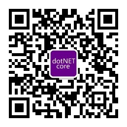

    

    <a href="README.md">English</a> |   
    中文

# .NET Core Community Home

.NET Core Community （.NET 中心社区，简称 NCC）是一个基于并围绕着 .NET 技术栈展开组织和活动的开源社区，由[刘怡](https://github.com/alexinea)先生、[刘浩杨](https://github.com/liuhaoyang)先生、[何镇汐](https://github.com/utilcore)先生、[谢炀](https://github.com/kiler398)先生和娄宇先生于 2016 年年中共同发起，由广大社区同僚共同参与建设。我们希望通过我们 NCC 社区的努力，能为 .NET 生态注入更多活力。

- Github: https://github.com/dotnetcore
- 官方网站: https://www.dotnetcore.xyz
- CORE QQ 群: 436035237
- PURE QQ 群：邀请制
- 微信群组: _二维码请在 CORE QQ 群里询问_

## 我们的历史

我们成立于 2016 年年中，原先名为「.NET Core 中文学习组（.NET Core China Studying Group）」，并在同一时间创建了我们的 QQ 群组「dotNET Core Studying Group」，且至今未更名。

NCC 最初的目标是翻译微软 ASP.NET Core（时名 ASP.NET 5）的官方文档。我们得到了许多人的帮助和鼓励（[2016 年翻译计划贡献者名单](./docs/history/people-who-translated-in-2016.md)），并在 Twitter 上获得了官方的点赞。我们的[翻译成果](https://github.com/dotnetcore/aspnetcore-doc-cn)也为第一批接触 ASP.NET Core 的中文开发者们提供了巨大的便利。

经历两年的挑战和考验，NCC 逐渐演变为一个开源社区组织，拥有了十多个成员项目和团队。

在这期间我们得到了许多人和组织的帮助，包括 JetBrains 公司对我们的赞助。

2019 年年初，我们尝试与中国地区的各地方 .NET 技术社区合作，联合发起了 [.NET 中文社区联席会议（.NET China Community Joint Meeting, NCJM）](https://github.com/dotnet-china)，并为该社区提供了 NCC 域名资产「dotnet-china.com」，我们则启用了全新域名「[dotnetcore.xyz](https://www.dotnetcore.xyz)」。

2019 年年末，我们通过并正式启用[《组织成员行为准则》](code-of-conduct.zh-CN.md)，由[社区修订与起草工作组（2019）](docs/history/revision-and-drafting-working-group-2019.md)负责修订和起草的四部新规定通过 NCC PMC 的投票，并于 2020 年 1 月 1 日起生效。

2020 年，我们期待社区得到更大的发展。

## 我们的行为准则

为了建设开放、创新、包容和热情的社区，我们制定了[组织成员行为准则](code-of-conduct.zh-CN.md)。

## 仓库与项目

我们的成员项目分为两阶段：_沙盒阶段（NCC Sandbox Projects phase）_ 和 _顶级项目阶段（NCC Top-Level Projects phase）_。当新项目申请加入 NCC 并完成评审和加入前的全部流程（包括预备工作）后，项目将自动进入 _沙盒阶段_。申请加入 NCC 请查阅[如何加入我们](#如何加入我们)一节。

### 顶级项目

_顶级项目阶段 NCC Top-Level Projects phase_ 的项目可用于生产环境。

- **[AspectCore](https://github.com/dotnetcore/AspectCore-Framework)**，.NET Standard 跨平台 AOP 框架。
- **[CAP](https://github.com/dotnetcore/CAP)**，基于最终一致性的微服务分布式事务解决方案，具有 Outbox 模式的事件总线。
- **[DotnetSpider](https://github.com/dotnetcore/DotnetSpider)**，类似 WebMagic 与 Scrapy 的 .NET Standard 轻量级、高效且高速的高级爬虫库。
- **[FlubuCore](https://github.com/dotnetcore/FlubuCore)**，跨平台构建与部署自动化系统，基于 C# 代码构建项目和执行部署脚本。（[FlubuCore 的示例](https://github.com/dotnetcore/FlubuCore.Examples)）
- **[NPOI](https://github.com/dotnetcore/NPOI)**，用于读写 Microsoft Office 二进制文件和 OOXML 文件格式的 .NET 类库。

### 沙盒项目

_沙盒阶段 NCC Sandbox Projects phase_ 的项目依旧处于快速发展阶段，且尚需时间和项目来检验其设计。

- **[Alipay SDK](https://github.com/dotnetcore/Alipay.AopSdk.Core)**，基于 .NET Standard 2.0 开发的第三方支付宝服务端 SDK，提供比官方更可靠的设计，但仍与官方 apis 保持一致。
- **[CanalSharp](https://github.com/dotnetcore/CanalSharp)**，[Alibaba Canal](https://github.com/alibaba/canal) 的开源 .NET 客户端，Alibaba Canal 是一个基于 MySQL `binlog` 的增量发布与订阅组件。更多信息请查阅 [https://github.com/alibaba/canal/wiki](https://github.com/alibaba/canal/wiki)。
- **[EasyCaching](https://github.com/dotnetcore/EasyCaching)**，开源缓存库，包含基本用法和缓存的高级用法，可助我们更轻松地处理缓存。
- **[FreeSql](https://github.com/dotnetcore/FreeSql)**，一款功能强大的 ORM 组件，支持 .NET Core、.NET Framework 和 Xamarin。目前 FreeSql 支持以下数据库：MySQL、PostgreSQL、SqlServer、Oracle、Sqlite、Odbc、微软 Access 以及国产数据库达梦。
- **[HttpReports](https://github.com/dotnetcore/HttpReports)**, 是一款基于 .NET Core 的轻量级 APM 系统，可在 .NET Core 环境下快速搭建统计、分析、图标、监控和分布式跟踪一体化的站点，适用于 ASP.NET Core MVC/WebAPI。HttpReports 上手简单，适合在微服务中使用。
- **[Magicodes Exporter and Importer](https://github.com/dotnetcore/Magicodes.IE)**，导入导出通用库，支持 Excel、Word、PDF 与 HTML。
- **[Natasha](https://github.com/dotnetcore/Natasha)**，简化 IL 操作，优化 IL 编程流程，并编写具有高性能的动态缓存。
- **[OSharp](https://github.com/dotnetcore/OSharp)**，全称 OSharp Framework with .NetStandard2.x，是一个基于 .NetStandard2.x 开发的一个 .NetCore 快速开发框架。这个框架使用最新稳定版的 .NetCore SDK（当前是.NET Core 3.1），对 AspNetCore 的配置、依赖注入、日志、缓存、实体框架、Mvc(WebApi)、身份认证、权限授权等模块进行更高一级的自动化封装，并规范了一套业务实现的代码结构与操作流程，使 .Net Core 框架更易于应用到实际项目开发中。
- **[SmartCode](https://github.com/dotnetcore/SmartCode)**，优秀的开源代码生成器（不仅仅是生成代码），它基于执行流程，支持 ETL 模式，高度灵活和可扩展，还支持自定义模板和多种模板样式，以及多种数据库。
- **[SmartSql](https://github.com/dotnetcore/SmartSql)**，通过简单的连接字符串来运行，解析 SQL 的 XML 配置和各种性能观察方法，使性能问题一目了然。 SmartSql 具有与 Dapper 相似的性能水平，并提供许多特性：动态代理存储、分布式缓存、类型处理器、自动生成 CUD 代码、分布式 Id 生成器、性能诊断、AOP 级别的事务/缓存（内存，分布式缓存）、读/写分离、代码生成器、高性能的批量插入等。
- **[Util](https://github.com/dotnetcore/Util)**，.NET Core 平台下的开源应用程序，旨在提高小型团队的开发效率。 它由通用帮助程序，分层体系结构设计，UI 组件，第三方组件和服务接口包组成。
- **[WebApiClient](https://github.com/dotnetcore/WebApClient)**，基于 HttpClient 的开源项目，只需通过定义 C# 接口并修改一些细节便可异步调用远程 http 接口。
- **[WTM](https://github.com/dotnetcore/WTM)**，针对中小规模后台管理系统的开发利器，基于 .NET Core，实现零编码创建项目、零编码生成业务模块。框架严格遵循 MVVM 的开发模式，经过数十个真实项目检测，可以极大提高开发效率，降低开发成本。

#### 外部沙盒项目与其他项目

- **[KoobooJson](https://github.com/kooboo/Json)**，更小更快的 C# JSON 序列化工具（基于表达式树构建）。
- **[ASP.NET Core 文档翻译计划](https://github.com/dotnetcore/aspnetcore-doc-cn)**，由 .NET China Foundation（已更名为 NCC）发起的微软 ASP.NET Core 文档翻译计划。
- **[NCC Collection extensions](https://github.com/dotnetcore/Collections)**，包括分页组件在内的集合扩展。
- **[NCC Compile Environment](https://github.com/dotnetcore/Compile.Environment)**，使用 Roslyn 库进行动态编译时，可以引入该库提供动态编译的环境。

想加入我们么？下一个 NCC 成员项目非你莫属！[下一节](#如何加入我们)将介绍如何加入我们。

## 如何加入我们

- 项目要求：[关于申请加入 NCC 的项目的规定（Community Project Accession Reg, 2020）](./docs/rules/community-project-accession-reg-2020.md)
- 加入步骤：[project-steps-for-joining-ncc.md](./docs/rules/project-steps-for-joining-ncc.md) _该规定将进行修订_

## 财资管理

### 捐赠

When you donate, **PLEASE TELL US YOUR NAME AND TO MARK "NCC"**, thank you.

当你捐赠时，**请标注「NCC」，并留下你的名字**，万分感激。

资金将由 LIU Haoyang 托管，并由 Alex Lewis 登记在册。

**万分感谢您的捐赠**

## 商业与政治相关的排除性规定

- [社区商业阻隔条例（Community Commercial Barriers Reg, 2020）](./docs/rules/community-commercial-barriers-reg-2020.md)
- [社区政治阻隔条例（Community Political Barriers Reg, 2020）](./docs/rules/community-political-barriers-reg-2020.md)

## 支持与赞助

## 微信公众号

在 2019 年，我出门创建了 NCC 社区微信公众号「NCC 开源社区」，欢迎诸位订阅。

NCC 微信公众号内的广告所得将用于公众号的日常运营、社区活动和支付稿酬。

## 反馈

- 在使用 [NCC 成员项目](#仓库与项目)遇到问题，请到相应项目下提交 issue；
- 对 NCC 的建议和意见，可以[在此创建 issue](https://github.com/dotnetcore/Home/issues/new)，与我们取得联系；
- 也可以通过 QQ 群（号码 436035237）反馈。
  这个群是个 3000 人大群，感谢谢炀先生每年为这个群续费。
- 以下方式都是可以接受的：
  - 在我们微信公众号的后台留言：OpenNCC；
  - 关注我们的推特：[@ncc_community](https://twitter.com/ncc_community)
  - 关注我们的电报频道：[@ncc_radio](https://t.me/nccradio)
- 最后，你可以通过邮件与我们取得联系：`dotnet-community#outlook.com` （将 `#` 改为 `@`）