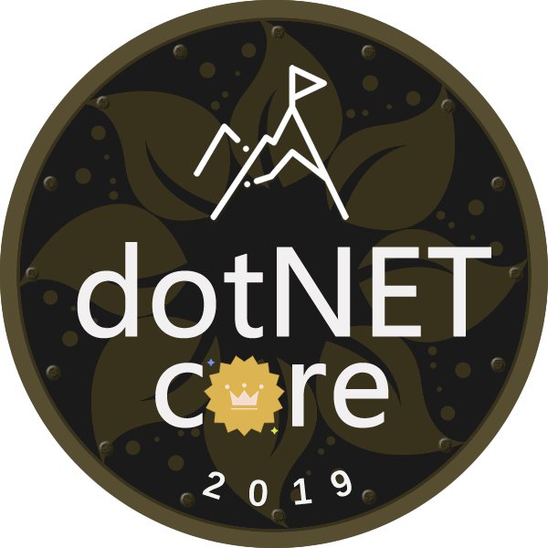

    

# Revision and Drafting Working Group (2019)

In order to allow the [NCC's rules and regulations](../rules-index.md) to better support the development of the Organization, [Alex LEWIS](https://alexinea.com) formed this group on December 1, 2019.

The mission of this working group is to cooperate with the members of the NCC Convenor Meeting to revise the NCC rules and regulations, review the amendments and make comments and suggestions, discuss and formulate [NCC's community political barrier regulations](../rules/community-political-barriers-reg-2020.md), and vote on these newly revised or formulated regulations . The rules and regulations adopted by the vote will be submitted to the NCC PMC for collective review and voting.

On December 31, 2019, the NCC PMC completed its vote and passed four new rules and regulations:

- [NCC Community Project Accession Reg, 2020](../rules/community-project-accession-reg-2020.md)
- [NCC Community Project Recommendation Reg, 2020](../rules/community-project-recommendation-reg-2020.md)
- [NCC Community Commercial Barriers Reg, 2020](../rules/community-commercial-barriers-reg-2020.md)
- [NCC Community Political Barriers Reg, 2020](../rules/community-political-barriers-reg-2020.md)

Members of this group come from inside and outside the NCC. The following sorting is arranged according to the amount of contributions made by members of the working group.

- [刘怡(AlexLEWIS)](https://github.com/alexinea)
- [简玄冰](https://github.com/jianxuanbing)
- [何泰然(NCoreCoder)](https://github.com/htrlq/)
- [邢文(Richfiter)](https://github.com/xingwen1987)
- [刘浩杨(Lemon)](https://github.com/liuhaoyang)
- [LanX](https://github.com/NMSAzulX)
- [杨晓东(Savorboard)](https://github.com/yang-xiaodong)
- [谢炀(Kiler)](https://github.com/kiler398)

The mission of this group was completed on December 31, 2019, and was dissolved on that date.
